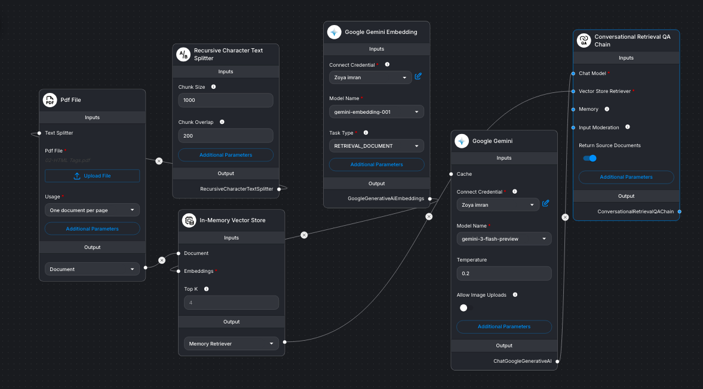
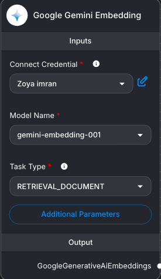
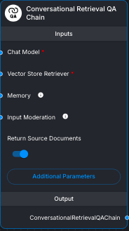

# Universal PDF Knowledge Assistant 📄🤖

A Flowise-based Retrieval-Augmented Generation (RAG) application that allows users to upload a PDF and ask questions about its contents.

The assistant processes the document, creates semantic embeddings, retrieves relevant sections, and uses Google Gemini to generate answers grounded in the uploaded PDF.

---

## 🎯 Project Goal

The goal of this project is to build a document-based AI assistant that can answer questions about an uploaded PDF while reducing hallucinations by grounding responses in the document's retrieved content.

This project was developed as an expanded version of an AI & Workflow Automation internship task, with the goal of turning the original task into a practical portfolio project.

---

## ✨ Features

* 📄 PDF document processing
* ✂️ Automatic text chunking
* 🧠 Google Gemini embeddings
* 🔎 Semantic document retrieval
* 💬 Conversational question answering
* 🔄 Follow-up question handling
* 🛡️ Prompt-based response grounding
* 🚫 Explicit handling of information not found in the document
* ⚡ Visual, low-code implementation using Flowise

---

## 🏗️ Architecture

```text
PDF
 ↓
Recursive Character Text Splitter
 ↓
Google Gemini Embeddings
 ↓
In-Memory Vector Store
 ↓
Memory Retriever
 ↓
Conversational Retrieval QA
 ↓
Google Gemini
 ↓
Grounded Answer
```

For a detailed explanation of each component, see:

[`docs/architecture.md`](docs/architecture.md)

---

## 🔄 How It Works

### 1. Upload PDF

The user provides a PDF document to the system.

### 2. Extract and Split Text

The PDF content is extracted and divided into smaller chunks using the Recursive Character Text Splitter.

Current configuration:

* **Chunk Size:** 1000
* **Chunk Overlap:** 200

### 3. Generate Embeddings

Each text chunk is converted into a vector representation using:

**Google `gemini-embedding-001`**

with the retrieval-document task type.

### 4. Store Embeddings

The generated vectors are stored in Flowise's **In-Memory Vector Store**.

The current retriever uses:

**Top K = 4**

to retrieve relevant chunks.

### 5. Retrieve Relevant Information

When the user asks a question, the Memory Retriever searches the vector store and returns the document chunks that are most relevant to the question.

### 6. Generate an Answer

The retrieved information is passed to the Conversational Retrieval QA Chain.

The chain uses:

**Gemini 3 Flash Preview**

to generate the final response.

### 7. Ground the Response

Custom prompts instruct the assistant to:

* Use retrieved PDF information.
* Avoid relying on outside knowledge.
* Avoid inventing information.
* Clearly state when information cannot be found in the uploaded document.
* Handle follow-up questions using conversation context.

---

## 💬 Example Questions

The assistant can handle questions such as:

### Direct Questions

> What is the main topic discussed in the document?

### Explanations

> Explain this concept in simple terms.

### Follow-up Questions

> What are its main advantages?

### Out-of-Scope Questions

> What is the capital of Japan?

For questions whose answers cannot be found in the uploaded document, the assistant is instructed to state that the information is not available rather than generating an unsupported answer.

---
## 🖼️ Project Screenshots

### Complete Architecture

The complete Flowise workflow showing the document processing, embedding, retrieval, and generation pipeline.



### PDF Loader

The PDF Loader receives the uploaded document and passes the extracted content to the text-splitting stage.


### Text Splitting

The Recursive Character Text Splitter divides the document into manageable chunks with overlap between consecutive chunks.


### Gemini Embeddings

Google Gemini Embeddings convert the document chunks into vector representations for semantic retrieval.



### Vector Store

The In-Memory Vector Store stores the generated document embeddings and provides them to the retrieval system.


### Retrieval

The Memory Retriever searches for document chunks relevant to the user's question.



### Gemini Chat Model

The Gemini Chat Model generates the final response using the retrieved document context.


### Chat Responses

Examples of the assistant answering questions using the uploaded PDF.


---

## 🛠️ Technologies Used

| Technology                            | Purpose                                    |
| ------------------------------------- | ------------------------------------------ |
| **Flowise**                           | Visual AI workflow development             |
| **Google Gemini**                     | Language model for answer generation       |
| **Gemini Embeddings**                 | Semantic representation of document chunks |
| **In-Memory Vector Store**            | Temporary vector storage                   |
| **Recursive Character Text Splitter** | Document chunking                          |
| **Conversational Retrieval QA**       | Retrieval + question answering             |

---

## 📌 Current Version

### V1 — Single PDF Knowledge Assistant

The current version focuses on processing and querying **one PDF at a time**.

The project intentionally uses an In-Memory Vector Store to keep the first version simple and avoid requiring additional database or server infrastructure.

---

## ⚠️ Limitations

### Single PDF

The current version is designed to work with one uploaded PDF at a time.

### Temporary Vector Storage

The current vector store is in memory rather than persistent storage. The document may therefore need to be processed again after restarting the Flowise environment.

### No Authentication

This prototype does not currently include user accounts or authentication.

### No Multi-PDF Search

The system does not yet support searching across multiple documents simultaneously.

---

## 🚀 Future Improvements

Planned improvements include:

* Persistent vector database
* Multi-PDF support
* Document management
* Source citations
* Metadata filtering
* Improved chat interface
* Conversation persistence
* User authentication
* Additional document formats
* Web deployment
* More advanced retrieval strategies

---

## 📚 Documentation

Detailed technical architecture:

[`docs/architecture.md`](docs/architecture.md)

---

## 👩‍💻 Project Context

This project was developed as part of an **AI & Workflow Automation internship** and expanded beyond the original task requirements into a portfolio-oriented Retrieval-Augmented Generation application.

The project focuses on understanding the complete document-question-answering pipeline rather than simply creating a chatbot.

---

## 📄 License

This project is intended for educational and portfolio purposes.
